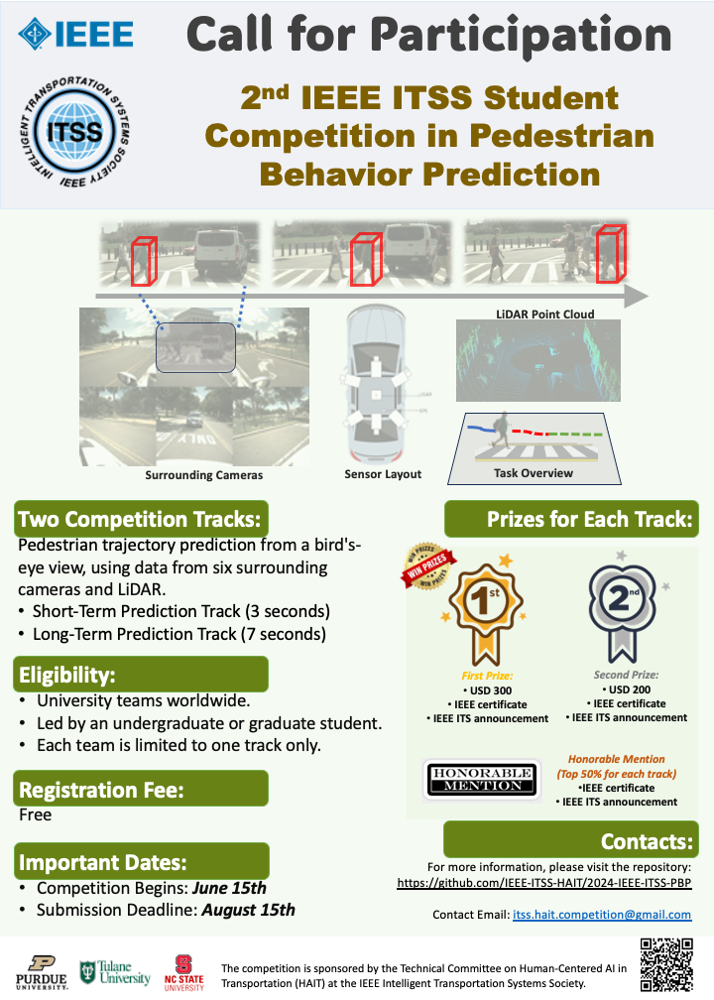

## Welcome to the 2nd IEEE ITSS Student Competition on Pedestrian Behavior Prediction!

## Video Demo
<video width="600" controls autoplay loop>
  <source src="https://github.com/IEEE-ITSS-HAIT/2024-IEEE-ITSS-PBP/raw/competition_release_1.0/videos/demo_ppt.mp4" type="video/mp4">
  Your browser does not support the video tag.
</video>

## Background
Pedestrian behavior prediction is one of the most critical challenges for fully automated driving in urban settings. It requires autonomous vehicles to interact safely and efficiently with pedestrians in diverse and dynamic environments. Accurate and robust pedestrian behavior prediction is crucial to ensure the safety of both pedestrians and autonomous vehicles.

## Competition Tasks
- **Short-Term Pedestrian Trajectory Prediction (ST-PTP)**
- **Long-Term Pedestrian Trajectory Prediction (LT-PTP)**

PTP forecasts a pedestrian's future trajectory from a bird's-eye view, using observed data from six surrounding cameras and lidar. The Short-Term Prediction (ST) targets a 3-second future path, while the Long-Term Prediction (LT) extends to 7 seconds.

## Eligibility
We invite competitors from all around the world. Each team's leader must be a current undergraduate or graduate student. Teams are limited to entering one track only.

## Prizes


## Important Dates
- **Competition Begins:** June 15th
- **Dry Run:** August 10th
- **Submission Deadline:** August 15th
## Get Started
### Data Description
Our dataset consists of a total of 500 scenarios, which are split into training, validation, and test sets with a ratio of 70%, 10%, and 20%, respectively. Each scenario is at least 20 seconds long. The data provided includes:

- **Lidar Frame:** Captured at 10 FPS, with annotations provided at 1 FPS.
- **Surrounding Cameras:** Six camera images captured at 10 FPS.
- **Extrinsic and Intrinsic Matrix:** Provided for calibration.

The annotations on the lidar frame include the following objects:
- Pedestrian
- E-scooter
- Bicyclist
- Vehicle
- Bus
- Traffic light/sign
### Sample Data
[Instructions or link to sample data]

### Train and Validation Data
[Instructions or link to train and validation data]
## Evaluation Guidelines
 **All the metrics are averaged over the test samples.**

To ensure the accuracy and robustness of the pedestrian behavior prediction models, the following evaluation metrics will be used:

### Metrics for Evaluation

1. **Average Displacement Error (ADE)**
   - **Definition:** ADE measures the average Euclidean distance between the predicted trajectory and the ground truth trajectory over all annotated key points.
   - **Formula:** 
     ```markdown
     ADE = (1 / K) * Σ[ sqrt((x_k - x̂_k)² + (y_k - ŷ_k)²) ]
     ```
     where `K` is the total number of annotated key points, `(x_k, y_k)` is the ground truth position at key point `k`, and `(x̂_k, ŷ_k)` is the predicted position at key point `k`.

2. **Final Displacement Error (FDE)**
   - **Definition:** FDE measures the Euclidean distance between the predicted final position and the ground truth final position at the last annotated key point.
   - **Formula:**
     ```markdown
     FDE = sqrt((x_K - x̂_K)² + (y_K - ŷ_K)²)
     ```
     where `K` is the final annotated key point, `(x_K, y_K)` is the ground truth final position, and `(x̂_K, ŷ_K)` is the predicted final position.

3. **Miss Rate (MR)**
   - **Definition:** MR is the proportion of predicted trajectories that are further away from the ground truth trajectory by a certain threshold at the final annotated key point.
   - **Formula:**
     ```markdown
     MR = (1 / N) * Σ[ 1(sqrt((x_K^i - x̂_K^i)² + (y_K^i - ŷ_K^i)²) > δ) ]
     ```
     where `N` is the total number of predicted trajectories, `1` is the indicator function, and `δ` is the distance threshold.

4. **Collision Rate (CR)**
   - **Definition:** CR measures the percentage of predicted trajectories that collide with the other agents in the environment, calculated based on all points of the trajectories.
   - **Formula:**
     ```markdown
     CR = (1 / N) * Σ[ 1(collision(i)) ]
     ```
     where `collision(i)` indicates whether the `i`-th predicted trajectory collides with any obstacle.
### Important Notes

1. **Submission Format**
   - Participants must submit their predicted trajectories in a predefined format. Each submission should include the predicted coordinates for each pedestrian at each time step within the prediction horizon.

2. **Data Splitting**
   - The dataset will be divided into training, validation, and test sets. The training and validation sets will be provided to participants for model development and tuning. We will run a dry run on the validation set in our competition platform for you to test your results format, while the test set will be used for final evaluation.

3. **Prediction Horizon**
   - Short-Term Prediction (ST-PTP): Predicting the pedestrian trajectory for the next 3 seconds.
   - Long-Term Prediction (LT-PTP): Predicting the pedestrian trajectory for the next 7 seconds.

4. **Frame Rate Adjustment**
   - The annotated data are provided at 1 FPS, but the output trajectory needs to be at 5 FPS. Participants must ensure their predicted trajectories are interpolated to meet this requirement.

### Evaluation Procedure

- Submissions will be evaluated based on all metrics, where ADE, FDE, and MR are calculated only on the annotated key points. The CR will be calculated based on all the points of the trajectories.
- The final ranking will be based on the average ranking of all metrics.


## Steering Committee
- **Professor 1**
  - 
  - Affiliation
- **Professor 2**
  - 
  - Affiliation
- **Professor 3**
  - 
  - Affiliation

## Organizers
- **Organizer 1**
  - 
  - Affiliation
- **Organizer 2**
  - 
  - Affiliation
- **Organizer 3**
  - 
  - Affiliation
- **Organizer 4**
  - 
  - Affiliation
- **Organizer 5**
  - 
  - Affiliation
- **Organizer 6**
  - 
  - Affiliation



:bulb: This competition focuses on Short-Term Pedestrian Trajectory Prediction (ST-PTP) and Long-Term Pedestrian Trajectory Prediction (LT-PTP). PTP forecasts a pedestrian's future trajectory from a bird's-eye view, utilizing observed data from six surrounding cameras and lidar. The Short-Term Prediction (ST) targets a 3-second future path, while the Long-Term Prediction (LT) extends to 7 seconds.

<h1 align="center">Stay tuned for more information coming soon!</h1>


<p align="right">(<a href="#top">back to top</a>)</p>
