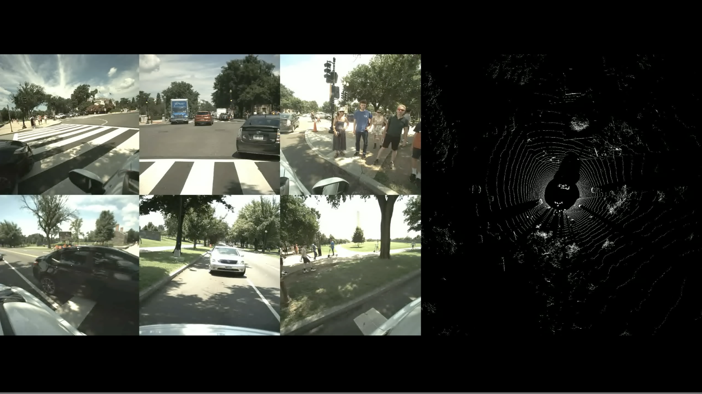

  

`[Competition Name]` **[Important Data Placeholder]** is [activated](https://github.com/OpenDriveLab/DriveLM/tree/main/challenge)!

## [Competition Name]

:bulb: Welcome to the official repository for the `[Competition Name]`! 

This competition focuses on [Brief Introduction Placeholder].

## Sponsors

- [Sponsor 1]
- [Sponsor 2]
- [Sponsor 3]

(<a href="#top">back to top</a>)

