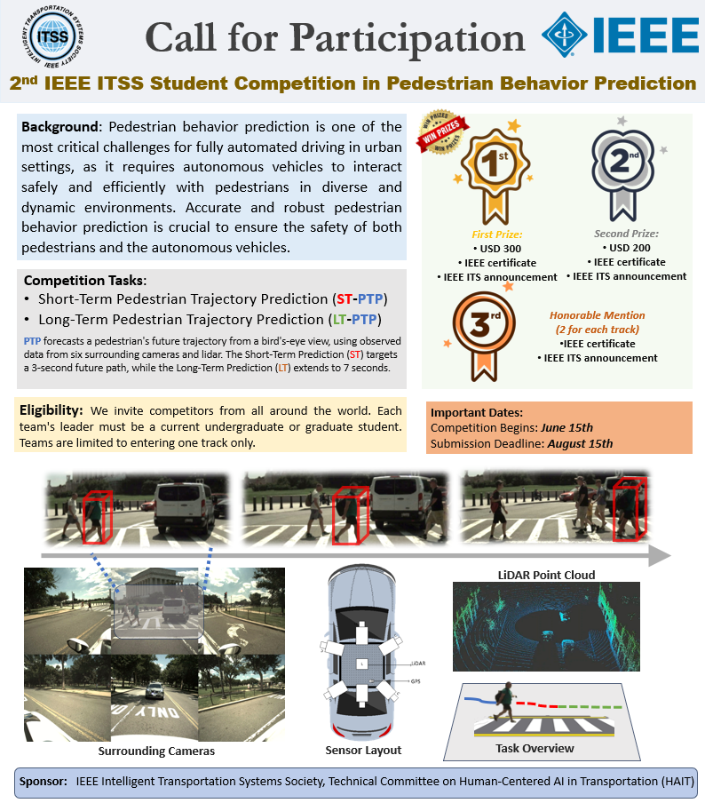

  

   
   

  <strong>2nd IEEE ITSS Student Competition in Pedestrian Behavior Prediction</strong>
  
   
   

## Welcome to the 2nd IEEE ITSS Student Competition in Pedestrian Behavior Prediction!

:bulb: This competition focuses on Short-Term Pedestrian Trajectory Prediction (ST-PTP) and Long-Term Pedestrian Trajectory Prediction (LT-PTP). PTP forecasts a pedestrian's future trajectory from a bird's-eye view, utilizing observed data from six surrounding cameras and lidar. The Short-Term Prediction (ST) targets a 3-second future path, while the Long-Term Prediction (LT) extends to 7 seconds.

<h2 align="center">Stay tuned for more information coming soon!</h2>

(<a href="#top">back to top</a>)

